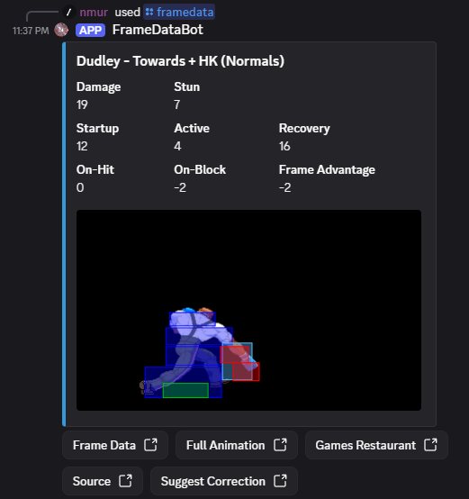

# 3s Frame Data Bot

A Discord bot for looking up 3rd Strike frame data sourced from http://ensabahnur.free.fr/BastonNew/index.php.

## Usage

> [!NOTE]
> Currently installation is invite only. Message `nmur` on Discord if you have interest in installing this bot in your server.

- Discord slash command: `/framedata character:<name> move:<move>`
- Best move match is chosen through fuzzy matching scored on established FGC termanology, colloquial names, etc
  - eg. `6hk`, `towards hk`, `towards roundhouse`, `dart shot` will all evaluate to the same move

## License

This project is licensed under the MIT License. See [LICENSE](LICENSE).

Street Fighter III: 3rd Strike is the property of its respective rights holders. This project is an unofficial community tool.

## Acknowledgements

- Huge thanks to [ESN](http://ensabahnur.free.fr/) for their very valuable [frame data website](http://ensabahnur.free.fr/BastonNew/index.php) as well as their permission to use their data and assets for this project.
- Developed using [Spec Kit](https://github.com/github/spec-kit) and Codex with GPT-5.3-codex/5.5.
