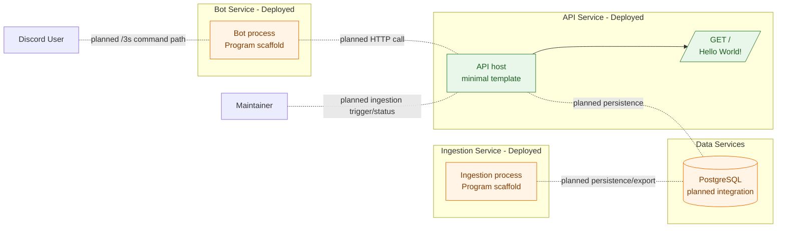

# Current-State Architecture

## Component Notes (Current State)

| Component | Role | Implemented | Not Yet Implemented |
|---|---|---|---|
| Bot Service | Runs Discord-facing command flow and response UX. | Process scaffold (`Program.cs`) and project wiring. | Command parser/handler, API client flow, response formatter behavior. |
| API Service | Provides HTTP boundary for query and ingestion operations. | Minimal host template and root endpoint (`GET /`). | Move query endpoint, ingestion endpoints, health + DI wiring, contract-complete responses. |
| Ingestion Service | Coordinates scraping, transforms, persistence, and export. | Process scaffold (`Program.cs`) and project wiring. | Orchestrator, run-status lifecycle, partial-success handling, export workflow. |
| Scraper Library | Retrieves and parses source data pages. | Library scaffold only. | HTTP loader, section parsers, hitbox parser. |
| Domain Library | Core entities and business rules shared by services. | Library scaffold only. | Character/move models, lookup logic, alias/fuzzy matching, metadata/media models. |
| Infrastructure Library | DB/storage adapters and persistence implementations. | Library scaffold only. | DB connection + schema bootstrap, repositories, JSON/image storage services. |
| Shared Library | Shared contracts/primitives reused across services. | Library scaffold only. | Shared DTO/contracts, result/error primitives. |
| PostgreSQL | Persistent store for queryable move/ingestion data. | Not integrated yet. | Schema bootstrap, repositories, runtime connectivity from API/Ingestion. |

## Notes on Mermaid Line Breaks

- If your renderer is strict, prefer ` ` over `\\n` in node labels.
- This diagram uses ` ` for compatibility across common Mermaid extensions.
