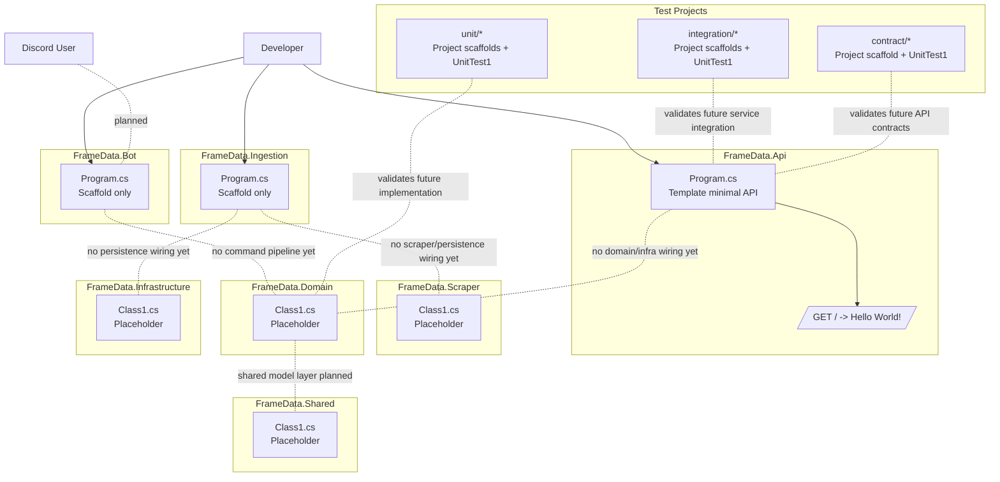

```mermaid
flowchart TD
  %% Current app state for 3sFrameDataBot (2026-03-31)
  %% Reflects rollback to Phase 1-only scaffolding.

  Dev[Developer]
  User[Discord User]

  subgraph Bot[FrameData.Bot]
    BotProgram[Program.cs\nScaffold only]
  end

  subgraph Api[FrameData.Api]
    ApiProgram[Program.cs\nTemplate minimal API]
    Root[/GET / -> Hello World!/]
  end

  subgraph Ingestion[FrameData.Ingestion]
    IngestionProgram[Program.cs\nScaffold only]
  end

  subgraph Scraper[FrameData.Scraper]
    ScraperClass[Class1.cs\nPlaceholder]
  end

  subgraph Domain[FrameData.Domain]
    DomainClass[Class1.cs\nPlaceholder]
  end

  subgraph Infrastructure[FrameData.Infrastructure]
    InfraClass[Class1.cs\nPlaceholder]
  end

  subgraph Shared[FrameData.Shared]
    SharedClass[Class1.cs\nPlaceholder]
  end

  subgraph Tests[Test Projects]
    Unit[unit/*\nProject scaffolds + UnitTest1]
    Integration[integration/*\nProject scaffolds + UnitTest1]
    Contract[contract/*\nProject scaffold + UnitTest1]
  end

  Dev --> BotProgram
  Dev --> ApiProgram
  Dev --> IngestionProgram
  User -.planned.- BotProgram
  ApiProgram --> Root

  BotProgram -.no command pipeline yet.- DomainClass
  ApiProgram -.no domain/infra wiring yet.- DomainClass
  IngestionProgram -.no scraper/persistence wiring yet.- ScraperClass
  IngestionProgram -.no persistence wiring yet.- InfraClass
  DomainClass -.shared model layer planned.- SharedClass
  Unit -.validates future implementation.- DomainClass
  Integration -.validates future service integration.- ApiProgram
  Contract -.validates future API contracts.- ApiProgram

  classDef planned stroke-dasharray: 5 5;
```
